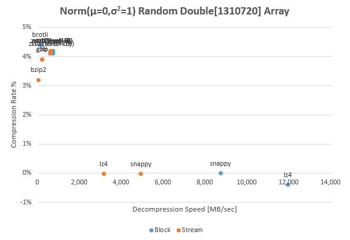

# JavaVM Compression Libraries Benchmark &amp; Comparison

The purpose of this repository is to decide a suitable compression algorithm for the data characteristics and performance of interest.

In general, the compression ratio and the processing speed are a trade-off in the compression algorithm. Therefore, compression algorithms roughly be able to categorized into high speed with low compression (HSLC) type and low speed with high compression (LSHC) type. The HSLC is suitable for online streaming processing where low latency and high throughput is important, and LSHC is suitable for data storage and transfer over the Internet.

In this benchmark, I consider [Snappy](https://github.com/google/snappy), [lz4](https://github.com/lz4/lz4) as HSLC, and Java standard GZIP and ZLib, [BZIP2](http://www.bzip.org/), [Brotli](https://github.com/google/brotli) and [ZStandard](https://github.com/facebook/zstd) as LSHC, and compare each other.


## Benchmark Results

* [2018/03/22: Windows 10 (Core i7-7700)](benchmark/amd64_windows10_20180322.md)

In above benchmark result, the API that compresses from `byte[]` to `byte[]` and the API that uses `InputStream`/`OutputStream` are distinguished by **block** and **stream** respectively.

The **java:*uncompress*** doesn't compress or expand binary, only copy between buffer and buffer with `System.arraycopy()`. This is logically the fastest algorithm running on its JavaVM, so this can be considered as pure overhead. The implementation that using JNI can be faster than this.

The **java:zlib** (deflate) and **java:gzip** are well-known Java standard compression APIs.
In addition, this test benchmarks [Snappy](https://github.com/google/snappy), [lz4](https://github.com/lz4/lz4), [Brotli](https://github.com/google/brotli) and [ZStandard](https://github.com/facebook/zstd).

The ZStandard implementation of Apache Commons Compress depends on `luben/zstd-jni`. So, this benchmark uses only `zstd-jni`.


### Numeric-Type Array Compression


In this benchimark, an `Int[]` of 2.6M length that filled with Normal (Gaussian) random numbers with average μ=0, variance σ<sup>2</sup>=100 are converted into a 10MB binary with Big Endianness. This means that 68% of all `Int` elements are included in range of ±10, and 95% are included in the range of ±20. In other words, almost all values are represented within 1 byte, the remaining 3 bytes are `0x00` or `0xFF`.

In such a binary, all algorithms show higher compression ratio characteristics, in particular, 70-80% has been reduced in LSHC algorithms. Also the deference between LSHC and HSLR is reduced in term of decompression speed, therefore the superiority of HSLR type becomes lower.



The IEEE 754 binary of double-precision floating point has higher randomness and entropy. For this reason, the compression ratios of HSLR algorithms are minus (that is, increase), and the LSHRs are also only less than 5%.

### Text Compression


The us-ascii text fits all characters between 0x00 and 0x7F.
The through put of the high-speed low compression ratio algorithm such as lz4 and snappy is remarkable.


Likewise, the characteristics of HSLC and LSHC are remarkable in utf-8 text, too.
In the case of text data, it seems that lz4 for speed priority and ZStandard for compression ratio priority are better.

## How to Try Your Benchmark

```
$ git clone https://github.com/torao/benchmark.compression.git
$ cd benchmark.compression
$ sbt run
```

Please edit [machine-info.xml](/torao/benchmark.compression/blob/master/machine-info.xml) to suit your platform. These properties such as CPU brand are finally embedded in the benchmark report. It is necessary to rewrite library dependencies  in [build.sbt](/torao/benchmark.compression/blob/master/build.sbt) to suite your platform for some compression implementations.

In case you benchmark a new binary pattern, add data generation and additional information to [Benchmark.scala](/torao/benchmark.compression/blob/master/src/main/scala/at/hazm/benchmark/compression/Benchmark.scala), and list it in Main.scala. To add a new compression algorithm, please edit dependencies in `build.sbt` and create a [Compressor](/torao/benchmark.compression/blob/master/src/main/scala/at/hazm/benchmark/compression/Compressor.scala) implementation as well.

### Known Issues

In **Snappy**, Apache Commons Compress and xerial snappy-java seems to compete under native library. When using the xerial one after benchmark of Apache's, the JavaVM process abnormally aborted due to an access violation, unexpected buffer corruption, or array length `buffer.length` returns a negative value and so on.

The following exception occurs when I give 5MB over compressed data to `BrotliInputStream` in **Brotli** 0.5.0, so the benchmark of Brotli is done only for block.

```
java.io.IOException: Compressor did not consume all input
  at org.meteogroup.jbrotli.io.BrotliInputStream.readChunkFromInput(BrotliInputStream.java:107)
  at org.meteogroup.jbrotli.io.BrotliInputStream.read(BrotliInputStream.java:44)
  at java.io.InputStream.read(InputStream.java:170)
  at org.meteogroup.jbrotli.io.BrotliInputStream.read(BrotliInputStream.java:56)
  ...
```