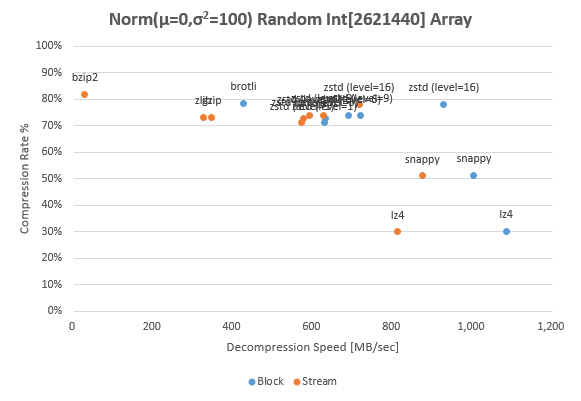
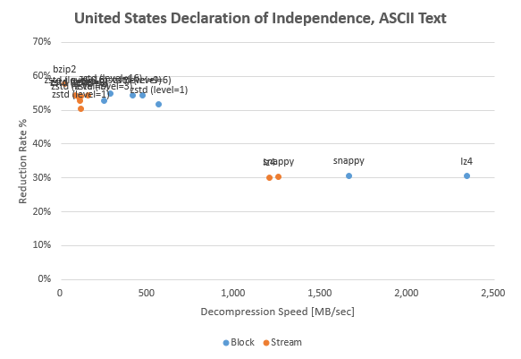
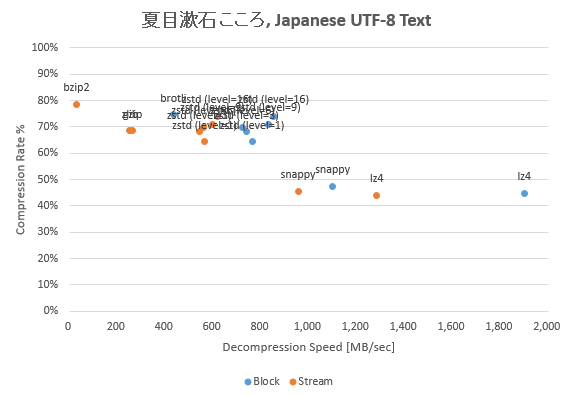

# JavaVM Compression Libraries Benchmark &amp; Comparison

The purpose of this repository is to decide a compression algorithm suitable for the data characteristics and performance of interest.

Compression algorithms that be able to used with JavaVM include those that give priority to compression ratio, those that priority to speed, others that are already obsolete. Generally, modern algorithm implementations use JNI. They are faster and higher compression ratios than Java standard GZIP (although, portability and stability are reduced).

## Benchmark Results

* [2018/03/22: Windows 10 (Core i7-7700)](benchmark/amd64_windows10_20180322.md)

In this benchmark, the API that compresses from `byte[]` to `byte[]` and the API that uses `InputStream`/`OutputStream` are distinguished by **block** and **stream** respectively.

The **java:*uncompress*** doesn't compress or expand binary, only copy between buffer and buffer with `System.arraycopy()`. This is logically the fastest algorithm running on its JavaVM, so this can be considered as pure overhead. The implementation that using JNI can be faster than this.

The **java:zlib** (deflate) and **java:gzip** are well-known Java standard compression APIs.

The ZStandard implementation of Apache Commons Compress depends on `luben/zstd-jni`. So, this benchmark uses only `zstd-jni`.

### Norm(μ=0,σ<sup>2</sup>=100) Random `Int[]`



In this benchmark, an `Int[]` of 2.6M length that filled with Normal (Gaussian) random numbers with average μ=0, variance σ<sup>2</sup>=100 are converted into a 10MB binary with Big Endianness. This means that 68% of all `Int` elements are included in range of ±10, and 95% are included in the range of ±20. In other words, almost all values are represented within 1 byte, the remaining 3 bytes are `0x00` or `0xFF`.

The compression rates for such a binary is very high, and 70-80% has been reduced in GZIP, BZIP2 and ZStandard.

### Text Compression



The us-ascii text fits all characters between 0x00 and 0x7F.
The through put of the high-speed low compression rate algorithm such as lz4 and snappy is remarkable.



Likewise, even in utf-8 text, the characteristics of the high-speed low compression rate algorithm and the low-speed high compression rate algorithm are remarkable.
In the case of text data, it seems that lz4 for speed priority and ZStandard for compression rate priority are better.

### Other Benchmarks

## How to Try Your Benchmark

```
$ git clone https://github.com/torao/benchmark.compression.git
$ cd benchmark.compression
$ sbt run
```

Please edit `machine-info.xml` to suit your platform. These properties such as CPU brand are finally embedded in the benchmark report.

In case you will add a benchmark of new binary pattern you wish, add data generation and additional information to [Benchmark.scala](/torao/benchmark.compression/blob/master/src/main/scala/at/hazm/benchmark/compression/Benchmark.scala), and list it in Main.scala. To add a new compression algorithm, create a [Compressor](/torao/benchmark.compression/blob/master/src/main/scala/at/hazm/benchmark/compression/Compressor.scala) subclass as well.

### Recognized Issues

In **Snappy**, Apache Commons Compress and xerial snappy-java seems to compete under native library. When using the xerial one after benchmark of Apache's, the JavaVM process abnormally aborted due to an access violation, unexpected buffer corruption, or array length `buffer.length` returns a negative value and so on.

The [**Brotle**](https://github.com/google/brotli) occurs `java.lang.UnsatisfiedLinkError: org.meteogroup.jbrotli.BrotliCompressor.compressBytes(IIII[BII[BII)I` on Windows, so I skipped it.
